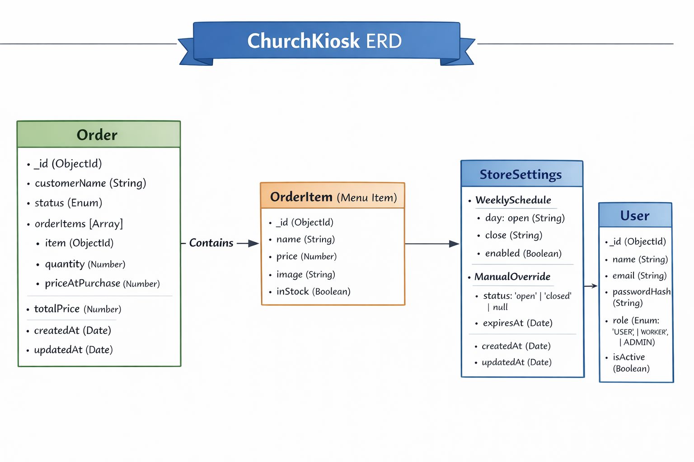

# Entity Relationship Diagram – ChurchKiosk

MongoDB + Mongoose Data Model

------------------------------------------------------

Order
------------------------------------------------------
_id (ObjectId)
customerName (String)
status (Enum)
orderItems [Array]
  ├─ item (ObjectId → OrderItem)
  ├─ quantity (Number)
  └─ priceAtPurchase (Number)
totalPrice (Number)
createdAt
updatedAt

Relationship:
Order (Many) → OrderItem (One)
An Order references multiple OrderItems.

------------------------------------------------------

OrderItem (Menu Item)
------------------------------------------------------
_id (ObjectId)
name (String)
price (Number)
image (String)
inStock (Boolean)
createdAt
updatedAt

Independent entity referenced by Order.

------------------------------------------------------

StoreSettings
------------------------------------------------------
_id (ObjectId)

weeklySchedule
  ├─ sunday
  ├─ monday
  ├─ tuesday
  ├─ wednesday
  ├─ thursday
  ├─ friday
  └─ saturday
      ├─ open (String)
      ├─ close (String)
      └─ enabled (Boolean)

manualOverride
  ├─ status ("open" | "closed" | null)
  └─ expiresAt (Date | null)

createdAt
updatedAt

Design Note:
Only one StoreSettings document is expected in the system.

